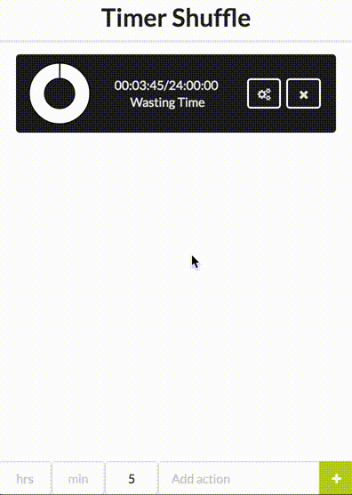

# Timer Shuffle
Your day constantly timed for maximum panic.



To use, run the following, following all defaults:
```
npm install
cd semantic
gulp build
cd ..
npm run watch
```
Then in a separate terminal run
```
npm run start
```
